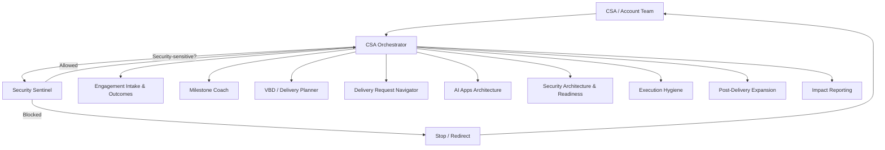

# CSA Helper — System Flow

High-level routing across the CSA Helper agents. Every user request enters
through the **CSA Orchestrator**, which consults the **Security Sentinel**
before dispatching to a specialist agent.

