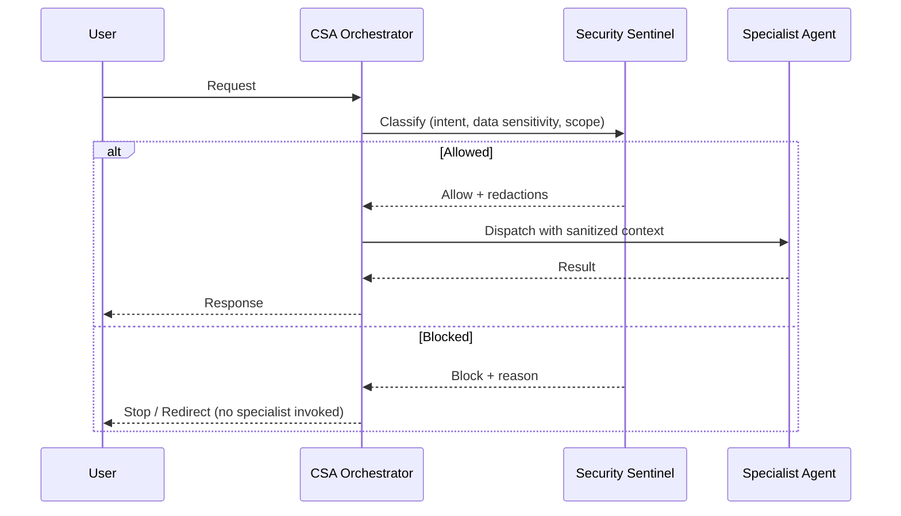

# CSA Helper — Security Sentinel Gate

Every prompt and tool invocation passes through Security Sentinel before any
agent action runs.

```mermaid
sequenceDiagram
    participant U as User
    participant O as CSA Orchestrator
    participant S as Security Sentinel
    participant A as Specialist Agent

    U->>O: Request
    O->>S: Classify (intent, data sensitivity, scope)
    alt Allowed
        S-->>O: Allow + redactions
        O->>A: Dispatch with sanitized context
        A-->>O: Result
        O-->>U: Response
    else Blocked
        S-->>O: Block + reason
        O-->>U: Stop / Redirect (no specialist invoked)
    end
```
